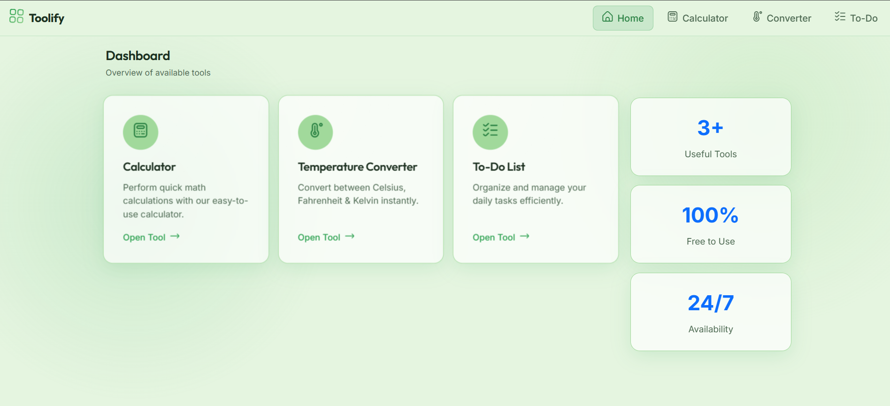
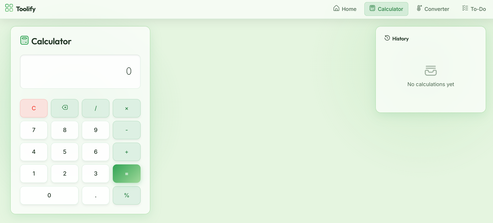
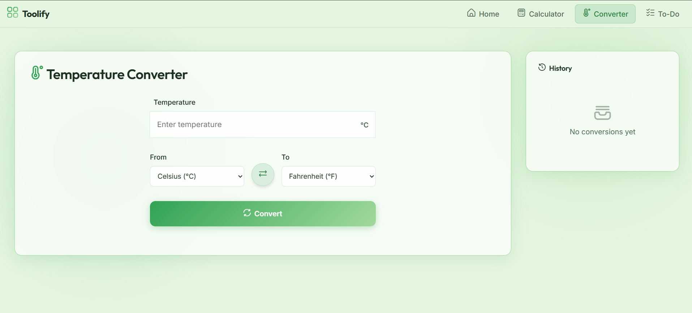
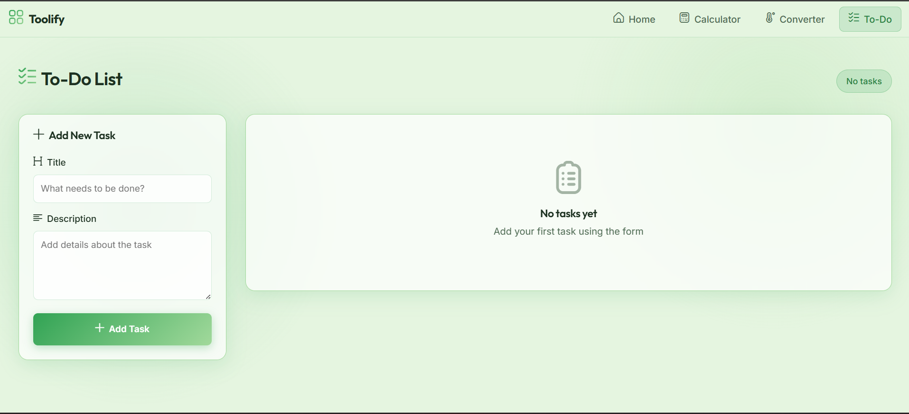

# Toolify Utils

Toolify Utils is a collection of utility tools built with React, TypeScript, and Framer Motion. It provides a sleek, animated, and responsive user interface for everyday utilities.

## Features

- **Dashboard:** A centralized hub to access all available tools with smooth 3D hover effects.
- **Calculator:** A fully functional calculator with history tracking and keyboard support.
- **Temperature Converter:** Instantly convert between Celsius, Fahrenheit, and Kelvin.
- **To-Do List:** Organize and manage your daily tasks efficiently.
- **Glassmorphic UI:** Modern and aesthetic design using CSS glassmorphism.
- **Page Transitions:** Seamless navigation animations powered by Framer Motion.

## Screenshots

| Dashboard | Calculator |
| :---: | :---: |
|  |  |
| **Temperature Converter** | **To-Do List** |
|  |  |

## Tech Stack

- **Framework:** React 19 + Vite
- **Language:** TypeScript
- **Styling:** Vanilla CSS with custom CSS variables
- **Animations:** Framer Motion
- **Routing:** React Router DOM v6

## Getting Started

### Prerequisites

Ensure you have [Node.js](https://nodejs.org/) installed on your machine.

### Installation

1. Clone the repository
2. Install dependencies:

   ```bash
   npm install
   ```

### Running Locally

To start the development server, run:

```bash
npm run dev
```

The application will be available at `http://localhost:5173`.

### Building for Production

To build the application for production, run:

```bash
npm run build
```

You can preview the production build locally with:

```bash
npm run preview
```

## Deployment

This project includes a `netlify.toml` file, making it ready for out-of-the-box deployment on [Netlify](https://www.netlify.com/).

1. Connect your repository to Netlify.
2. The build command (`npm run build`) and publish directory (`dist`) will be automatically detected.
3. Deploy!

## Project Structure

```bash
toolify-utils/
├── public/               # Static assets (icons, background image)
├── src/
│   ├── components/       # Reusable UI components (Navbar, Toast, Layouts)
│   ├── hooks/            # Custom React hooks (useSession, useToast)
│   ├── pages/            # Application pages (Home, Calculator, Todo, etc.)
│   ├── types/            # TypeScript type definitions
│   ├── utils/            # Utility functions
│   ├── App.tsx           # Main application component
│   └── index.css         # Global styles and CSS variables
├── netlify.toml          # Netlify deployment configuration
└── vite.config.ts        # Vite configuration
```

## Contributing

We welcome contributions! If you'd like to add a new tool or improve an existing one, please refer to our [Contributing Guide](CONTRIBUTING.md) for detailed instructions.
